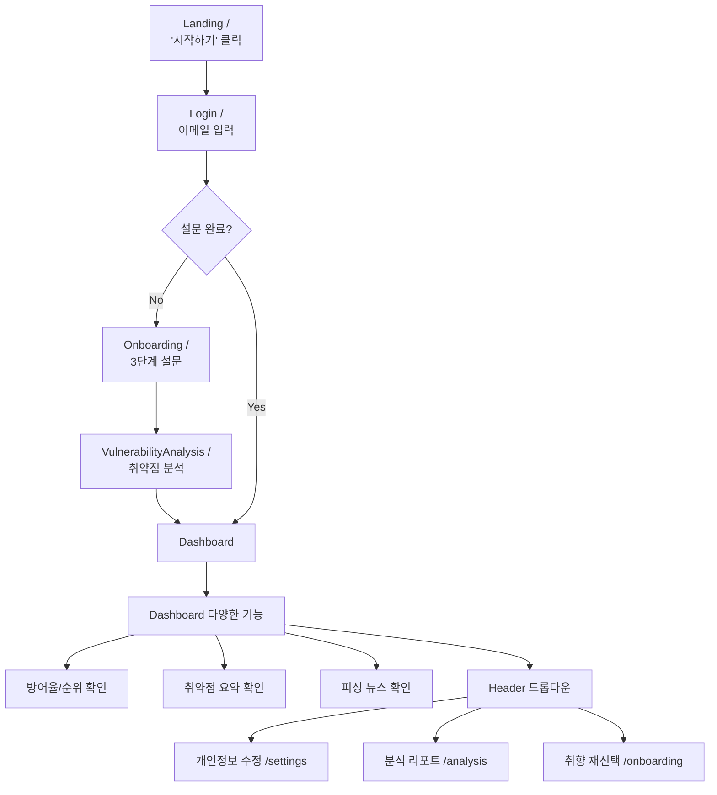

# 🎣 KangTaeGong MVP 간소화 버전 구현 완료

## 📋 요약

피싱 방지 서비스 MVP 버전을 성공적으로 구현했습니다. 주요 변경 사항:
- **데이터베이스**: Supabase → SQLite로 전환
- **인증**: 이메일 전용 로그인/가입 통합
- **LLM**: Gemini 2.5 Flash 연동 (google-genai SDK 마이그레이션 완료)
- **대시보드 전면 개편**: 모의 훈련 제거, 개인화 랭킹/분석 기능 강화
- **관리자**: 전용 대시보드 및 시뮬레이션 발송 기능

---

## 🔧 변경된 파일

### Backend (`src/backend/app/`)

| 파일 | 변경 유형 | 설명 |
|------|----------|------|
| [config.py](file:///mnt/c/GodKim/codes/Projects/KangTaeGong/src/backend/app/core/config.py) | 수정 | SQLite, Gemini API, SMTP, 관리자 인증 설정 추가 |
| [session.py](file:///mnt/c/GodKim/codes/Projects/KangTaeGong/src/backend/app/db/session.py) | 수정 | SQLite/PostgreSQL 분기 처리 |
| [init_db.py](file:///mnt/c/GodKim/codes/Projects/KangTaeGong/src/backend/app/db/init_db.py) | **신규** | DB 초기화 및 카테고리 시드 |
| [user.py](file:///mnt/c/GodKim/codes/Projects/KangTaeGong/src/backend/app/models/user.py) | 수정 | 연령대/성별 필드, SQLite UUID 호환 |
| [user_profile.py](file:///mnt/c/GodKim/codes/Projects/KangTaeGong/src/backend/app/models/user_profile.py) | 수정 | LLM 증강 필드 추가 |
| [simulation.py](file:///mnt/c/GodKim/codes/Projects/KangTaeGong/src/backend/app/models/simulation.py) | **신규** | 시뮬레이션/시나리오/스케줄 모델 |
| [gemini_service.py](file:///mnt/c/GodKim/codes/Projects/KangTaeGong/src/backend/app/services/gemini_service.py) | **신규** | Gemini API 연동 서비스 (google-genai SDK 1.0 적용) |
| [email_service.py](file:///mnt/c/GodKim/codes/Projects/KangTaeGong/src/backend/app/services/email_service.py) | 수정 | EmailService 클래스, 트래킹 기능 |
| [auth.py](file:///mnt/c/GodKim/codes/Projects/KangTaeGong/src/backend/app/api/v1/endpoints/auth.py) | 수정 | 이메일 전용/관리자 로그인 |
| [survey.py](file:///mnt/c/GodKim/codes/Projects/KangTaeGong/src/backend/app/api/v1/endpoints/survey.py) | 수정 | LLM 증강/취약점 분석 API |
| [users.py](file:///mnt/c/GodKim/codes/Projects/KangTaeGong/src/backend/app/api/v1/endpoints/users.py) | 수정 | 순위 조회, 개인정보 수정(PUT /me) API 추가 |
| [admin.py](file:///mnt/c/GodKim/codes/Projects/KangTaeGong/src/backend/app/api/v1/endpoints/admin.py) | **신규** | 관리자 API |
| [tracking.py](file:///mnt/c/GodKim/codes/Projects/KangTaeGong/src/backend/app/api/v1/endpoints/tracking.py) | **신규** | 이메일 열람/클릭 추적 |
| [main.py](file:///mnt/c/GodKim/codes/Projects/KangTaeGong/src/backend/app/main.py) | 수정 | 라우터 등록, lifespan 핸들러 |

### Frontend (`src/frontend/src/`)

| 파일 | 변경 유형 | 설명 |
|------|----------|------|
| [Landing.jsx](file:///mnt/c/GodKim/codes/Projects/KangTaeGong/src/frontend/src/pages/Landing.jsx) | 수정 | '시작하기' 버튼만 |
| [Login.jsx](file:///mnt/c/GodKim/codes/Projects/KangTaeGong/src/frontend/src/pages/Login.jsx) | 수정 | 이메일 전용 UI |
| [Onboarding.jsx](file:///mnt/c/GodKim/codes/Projects/KangTaeGong/src/frontend/src/pages/Onboarding.jsx) | 수정 | 3단계 설문 + LLM 증강 |
| [Dashboard.jsx](file:///mnt/c/GodKim/codes/Projects/KangTaeGong/src/frontend/src/pages/Dashboard.jsx) | 수정 | 모의훈련 제거, 훈련공지, 방어율/순위/취약점 요약 카드, 뉴스 섹션 추가 |
| [VulnerabilityAnalysis.jsx](file:///mnt/c/GodKim/codes/Projects/KangTaeGong/src/frontend/src/pages/VulnerabilityAnalysis.jsx) | **신규** | 취약점 분석 결과 페이지 (Markdown 렌더링) |
| [Settings.jsx](file:///mnt/c/GodKim/codes/Projects/KangTaeGong/src/frontend/src/pages/Settings.jsx) | **신규** | 개인정보 수정 페이지 |
| [Admin.jsx](file:///mnt/c/GodKim/codes/Projects/KangTaeGong/src/frontend/src/pages/Admin.jsx) | **신규** | 관리자 대시보드 |
| [Header.jsx](file:///mnt/c/GodKim/codes/Projects/KangTaeGong/src/frontend/src/components/layout/Header.jsx) | 수정 | 사용자 설정 드롭다운 메뉴 (개인정보 수정 포함) |
| [App.jsx](file:///mnt/c/GodKim/codes/Projects/KangTaeGong/src/frontend/src/App.jsx) | 수정 | 라우터 업데이트 (/settings 추가) |
| [auth.js](file:///mnt/c/GodKim/codes/Projects/KangTaeGong/src/frontend/src/api/auth.js) | 수정 | 이메일/관리자 로그인 API |
| [survey.js](file:///mnt/c/GodKim/codes/Projects/KangTaeGong/src/frontend/src/api/survey.js) | 수정 | LLM 증강/취약점 API |
| [users.js](file:///mnt/c/GodKim/codes/Projects/KangTaeGong/src/frontend/src/api/users.js) | 수정 | 사용자 순위 조회 API |

---

## 🚀 실행 방법

### 환경 변수 설정 (`.env`)

```bash
# SQLite 사용
DATABASE_URL=sqlite+aiosqlite:///./kangtaegong.db

# Gemini API (v1.0 SDK 호환)
GEMINI_API_KEY=your_gemini_api_key

# 관리자 계정
ADMIN_EMAIL=siinwoo036@gmail.com
ADMIN_PASSWORD=admin12!

# Gmail SMTP (기존 설정 유지)
SMTP_SERVER=smtp.gmail.com
SMTP_PORT=587
SMTP_USERNAME=your_email@gmail.com
SMTP_PASSWORD=your_app_password
EMAIL_FROM=your_email@gmail.com
```

### Backend 실행

```bash
cd src/backend

# 의존성 설치
pip install -r requirements.txt

# 서버 실행 (DB 자동 초기화)
python -m uvicorn app.main:app --reload --port 8002
```

### Frontend 실행

```bash
cd src/frontend
npm install
npm run dev
```

---

## ✅ 검증 결과

| 항목 | 상태 |
|------|------|
| Backend 모듈 임포트 | ✅ 성공 |
| SQLite DB 설정 | ✅ 완료 |
| Gemini API 연동 | ✅ 완료 (google-genai SDK 적용됨) |
| 라우터 등록 | ✅ 완료 (auth, users, survey, admin, tracking) |
| 대시보드 개편 | ✅ 완료 (모의훈련 제거, 순위/방어율 추가) |
| 개인정보 수정 | ✅ 완료 (/settings) |

---

## ⚠️ 주의사항

1. **Netlify 더미 페이지**: 현재 자동 배포 기능은 구현되지 않았습니다. 시나리오의 `dummy_page_url`을 수동으로 설정하거나, 향후 Netlify API 연동이 필요합니다.

2. **ReactMarkdown**: `VulnerabilityAnalysis.jsx`에서 사용합니다. 패키지 설치가 필요합니다:
   ```bash
   cd src/frontend && npm install react-markdown
   ```

---

## 📱 사용자 플로우


